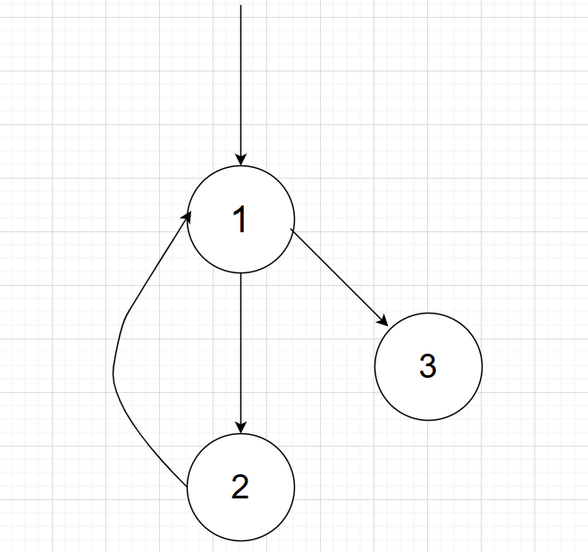

# 中间代码优化

**id**: 221220092谷莘，221220100杨杰

## 运行方式

编译过程：

```bash
cd Code
make
```

生成的程序是出现在Code目录下的parser，以下是parser的使用方法：

```bash
./parser ./path_to_Test/in.ir ./out.ir #in.ir 是等待被优化的中间代码,out.ir是优化后的中间代码
```

## 实现思路

### 必做部分

本次实验的必做部分使用了实验给出的框架，实现了全局公共子表达式消除，常量传播，全局无用变量消除，主要做的就是框架挖空的填空，按照实验教程完成即可。（p.s. 选做一做到这里就结束了，只需要填完框架的空，个人感觉有失公平性，希望至少能给做选作二和选做三的组一点加分补偿一下）

### 选做部分

本次实验实现了选做一 公共子表达式消除，无用代码消除，常量传播（填完框架的全局优化）和选做二循环不变式的外提。

#### 框架部分

本次实验的选做部分主要设计了三个结构用来完成循环不变式外提的任务，分别是支配树的存储结构，循环的存储结构和预头块（插入到循环的入口之前用来存储外提的循环不变式）的存储结构，具体如下：

```c
/* ====================== 支配树数据结构 ====================== */
typedef struct DomTreeNode {
    IR_block* block; // 对应的基本块
    struct DomTreeNode* idom; // 直接支配者
    int dominated_count; // 被支配的子节点数量
    IR_block* dominated[MAX_BLOCKS]; // 被支配的子节点数组
} DomTreeNode;

/* ====================== 循环检测数据结构 ====================== */
typedef struct {
    IR_block* header;          // 循环头节点
    int body_count;            // 循环体中基本块的数量
    IR_block* body[MAX_BLOCKS]; // 循环体包含的基本块
    int exit_count;            // 出口块数量
    IR_block* exits[MAX_BLOCKS]; // 循环出口块
    int depth;                 // 嵌套深度
    int children_count;        // 子循环数量
    int children_loops[MAX_BLOCKS]; // 子循环索引
} LoopInfo;

/* ====================== 预头块管理 ====================== */
typedef struct {
    IR_block* header;      // 循环头节点
    IR_block* preheader;    // 对应的预头块
} PreheaderRecord;
```

#### 主要思路

首先进行支配树的建立，然后通过支配树找出各个循环包含的block，在循环前面插入预头块，插入后重新更新控制流图，支配树和循环结构，之后再遍历各个block的stmt通过讲义中给出的四个条件判断一个stmt是否是循环不变式，如果是的话就把其外提至建立好的预头块中，循环不变式主要流程代码如下：

```c
// 初始构建支配树和循环检测
build_dominator_tree(func);

//找出各个循环和各个循环包含的block
find_loops(func);
    
// 插入预头块
insert_preheaders(func);

build_dominator_tree(func); // 重建支配树
find_loops(func);// 重新检测循环（考虑新块）

// 执行循环不变式外提
hoist_invariant_code(func);
```

#### 具体设计细节

支配树首先收集所有基本块到block_array数组并建立索引映射，之后查找入口块的索引直接处理支配者，其他块循环迭代计算直接支配者，通过支配信息构建支配树结构。

循环检测首先通过支配关系检测回边来识别循环，然后dfs收集当前循环所包含的块，之后通过判断某循环的循环头是否包含在另一循环中且不为另一循环的循环头处理嵌套关系并存储，最后收集每个循环的出口并储存。

预头块的插入首先通过PreheaderRecord创建要插入的预头块，之后将循环头原来的前驱的后继改为预头块，将循环头的前驱改为预头块，然后在存储基本块的链表中插入预头块并更新基本块数组。

循环不变式外提先将循环以深度顺序由深至浅排序，然后遍历循环列表，先查找循环的预头块，然后对于循环中的每一个基本块中的每一个语句进行判断，分别判断该语句是否循环不变，该基本块是否支配所有出口，该循环内是否无其他对该变量赋值，该基本块是否支配所有该变量的使用点，全部满足则修改链表结构把该语句提到预头块中。

#### 更进一步的优化

以下是手册中的循环不变式外提所不能处理的一种情况：



此时block2不能支配block3，无法处理block3的循环不变式，前提是循环的条件需要一定成立，如果这个循环的条件不一定成立则不能外提。因为这种情况并没有在手册中提出，代码中没有处理。一种可能的实现方法是在循环外面加入和循环条件相同的判断语句，如果成立则将循环的出口改为循环运行一遍后到达的最后一个block，不一定成立则使用原来的循环。判断语句判断是否一定成立可以用定值分析实现。

### 窥孔优化

进行了一些简单的窥孔优化，以下是一个我们实现中的一种情况：

```c
//优化目标
v2 = v1 op #1
v3 = v2 op #2
//优化成
v2 = v1 op #1
v3 = v1 op (#1 op #2)
```

